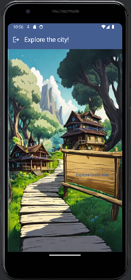
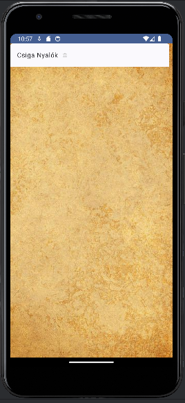
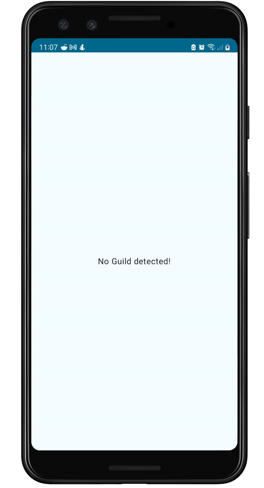
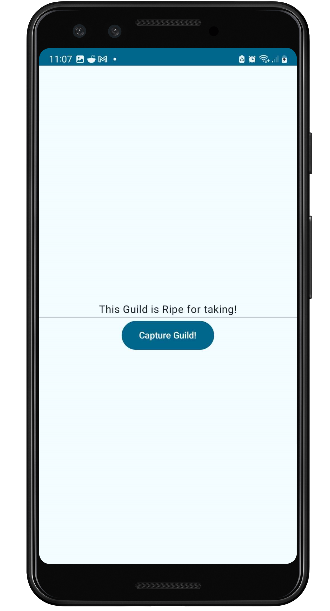
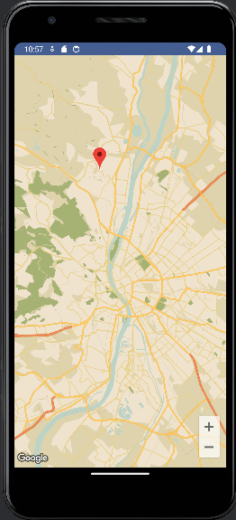

# Házi feladat specifikáció

Információk [itt](https://viauav21.github.io/laborok/hf)

## Androidalapú szoftverfejlesztés
### Dátum - 2024. tavaszi félév
### Simon Benedek Gábor - (CWTB5S)
### benedek.simon@gmail.com
### Laborvezető: Gazdi László

## Bemutatás

IRL pontfoglalós játék. A városban kihelyezett pontokat lehet elfoglalni, ezek pontot termelnek az adott játékosnak.
A legtöbb pontot szerző a király! 
A játék célja, hogy egy interaktív város-élményt adjon át és kimozdítsa az embereket.

## Főbb funkciók

Pontok elfoglalása NFC chipek beolvasásával. Elfoglalt pontok listázása. Kihelyezett pontok megtekintése térképen.

## Választott technológiák:

- UI: A felhasználói felület Jetpack Compose-ban és MVVM architektúrával.
- lista: a felhasználó láthatja majd az általa birtokolt pontokat
- Firebase: az adatbáziskezelés egy firebase adatbázison keresztül fog működni (DI)
- NFC: A játék NFC chipek használatával lesz elérhető
- Map: Egy térképen megtekinthetőek a már kihelyezett pontok

___

# Házi feladat dokumentáció

### City of Guilds

**Legkésőbb a dokumentáció fázisban lecserélendő a saját ikonnal!**

## Bemutatás

Az alkalmazás célja, hogy az emberek felfedezzék Budapestet. A városban kihelyezett 'Guild'-ek egy-egy érdekes pontot jelölnek.
Az alkalmazás fejleszti a navigációs készséget, és lehetőleg kimozdítja az embereket. A mindennapokba tud egy kis játékot vinni.

## Főbb funkciók

Az alkalmazás kezeli a felhasználókat, be lehet jelentkezni.
El lehet foglalni Guild-eket NFC technológia segítségével.
Eltárolja az adott felhasználó által elfoglalt Guild-eket, hogy mikor foglaltuk el azokat.
Egy térképen fel meg lehet tekinteni a városban található tag-eket.
A felhasználó által szerzett pontokat még nem számolja.

## Felhasználói kézikönyv

Az alkalmazás indulásakor egy bejelentkező képernyő fogad minket. Amennyiben nem rendelkezünk fiókkal, regisztrációs lehetőség is van.

1. ábra: Bejelentkezés

A fő képernyőn kiválaszthatjuk gombok segítségével melyik funkciót szeretnénk igénbe venni, vagy kijelentkezhetünk a bal felső sarokban elhelyezett iconnal.

2. ábra: Főképernyő

A listázásnál láthatjuk az általunk birtokolt pontokat.

3. ábra: Listázás

A pontfoglalásnál igénybe vehetjük az NFC funkciót. Amíg nem közelítünk meg egy megfelelő NFC taget, addig az egyik, majd a másik feliratot láthatjuk és egy gombot, hogy elfoglaljuk a Guild-et.

4. ábra: Az NFC tag megtalálása előtt és után

Egy stílusos térképen láthatjuk az elérhető pontokat a városban.

5. ábra: Térkép az elérhető pontokkal

## Felhasznált technológiák:

- **NFC** intentek fogadása, a telefon által küldött intent feldolgozása, nincs szükség külső alkalmazásra
- **Google Maps** felhasználása
- **Firebase Authentikáció**
- **Firebase Firestore** adattárolás

## Fontosabb technológiai megoldások

A projektben a nehézséget az NFC kommunikáció megoldása jelentette.
Először az *Alarm* labor mintájára akartam írni valami service szerűséget, ami intenteket fogad, stb., de az nem sikerült.
Utána elengedtem az egész BroadcastReciever dolgot és egyszerűen a MainActivity-m kezeli le a beérkezett intenteket, tovaküldi a megfelelő viewModel-nek.
Így már működött a dolog, csak mindig megnyílt egy új applikáció, de szerencsére megtaláltam, hogy hogyan biztosíthatom, hogy mindig csak 1 példány fusson az alkalmazásból és csak akkor fogadja az Intenteket, amikor épp ő van fókuszban.
Az onResume és onPause függvények jelzik a viewModel-nek, hogy épp fogadja-e a megkereséseket. Azt, hogy csak egy példány fusson azt pedig az Intent.FLAG_ACTIVITY_SINGLE_TOP oldotta meg.
