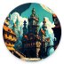
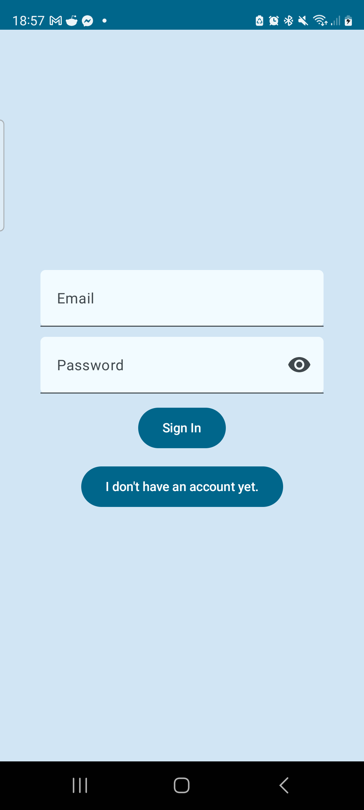
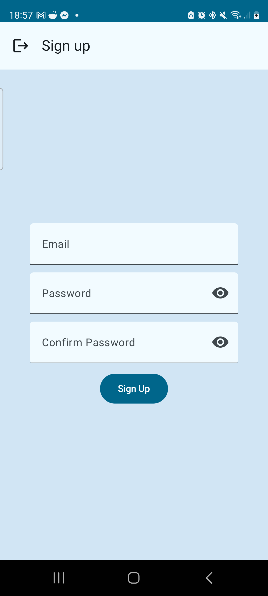
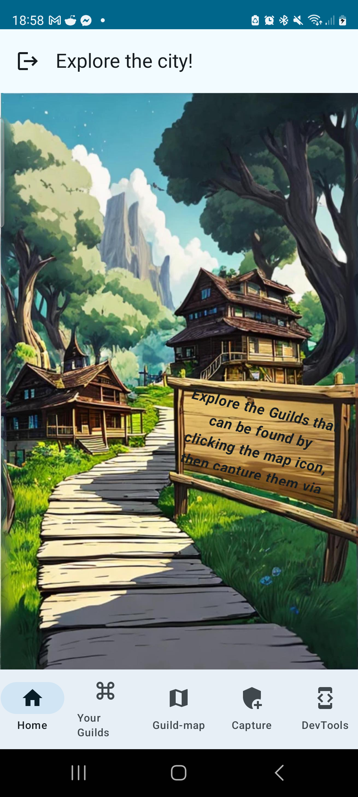
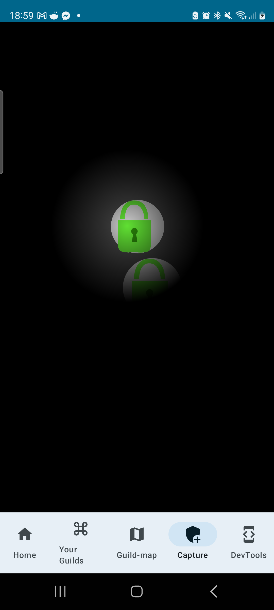

# Specification

## Bachelor's Degree Work
### Date - 2024. fall semester
### Simon Benedek Gábor - (CWTB5S)
### benedek.simon@gmail.com
### Consultant: Gazdi László

## Introduction

My application aims to motivate people to again cherish the city, the world around them, to see the community and be part of it, make it thrive. This app gives people the opportunity to visit previously unknown places, via the point-of-interests scattered throughout the map. It helps build habits to visit these places over and over again facilitating familiarity with our surroundings, increasing social interactions.

## Main Functions
- Login to play
- Capture Guilds via NFC
- Hold onto Guilds to earn points and be on top of the leaderboard
- Discover Guilds via the Guild map

## Technologies:

- UI: Compose UI with MVVM architecture.
- Custom Backend: Custom backend written for this application
- NFC: Use of NFC technology to read tags, and capture Guilds
- Map: A map fragment with skins to show Guilds with style :)

___

# Documentation

### City of Guilds

## User Guide

After starting the app, we are greeted with a login screen. If we do not have an account yet, we can sign up for one.

Fig 1: Login

Home screen, where we can navigate via the drawer

Fig 2: Home Screen

We can take a look at our captured guilds and the current leaderboard.

Fig 3: List

If we want to capture a guild we will have to approach an NFC tag. If it contains a guild we can capture it, after completing a minigame.

  
Fig 4: Capture process

We can also look at the map for capturable guilds.

Fig 5: Map with available Guilds

